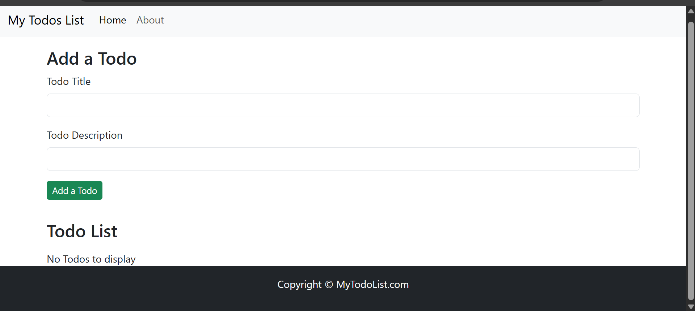
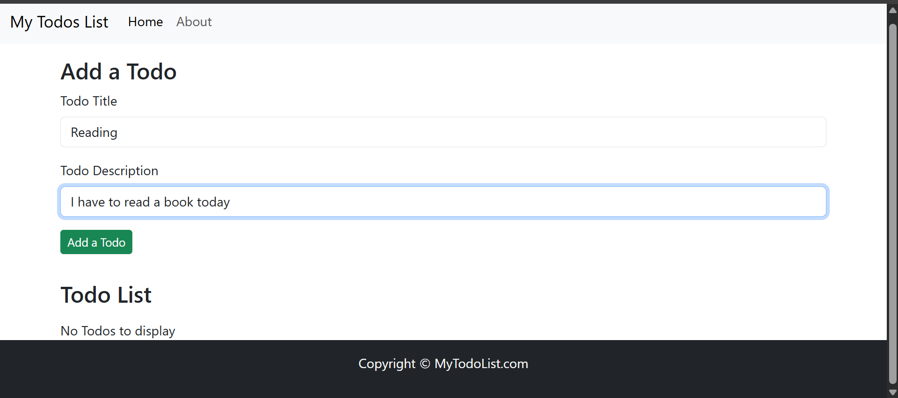
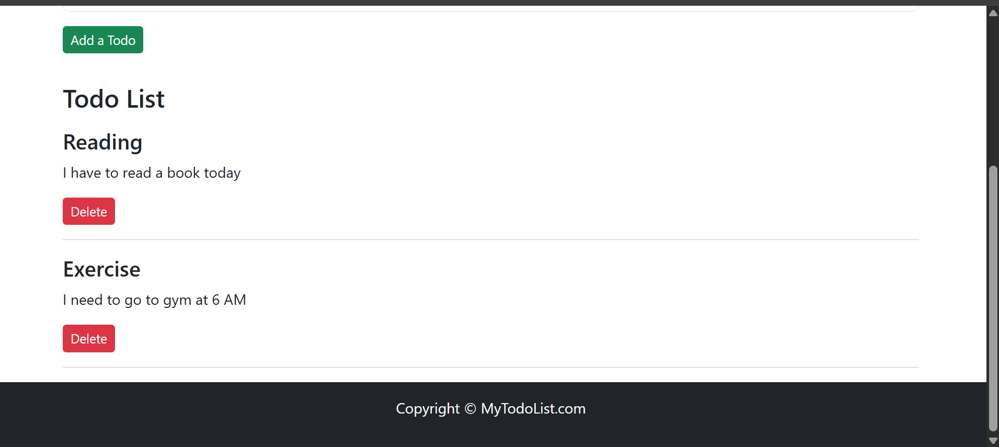

## React Todo List App:

A simple Todo List app built with React. This app lets you add, delete, and manage todos with persistence using localStorage. It also includes basic navigation using React Router.

## Screenshots:



- Add a todo with title and description





- React Router navigation (Home & About page)


## 🛠 Features

- Add a todo with title and description
- Delete individual todos
- Data persists in localStorage
- React Router navigation (Home & About page)
- Responsive Bootstrap layout

## ⚙️ Tech Stack

- React
- Vite
- Bootstrap 5
- React Router DOM

## Prerequisites:

- Install create-react-app

Install create-react-app npm package globally. This will help to easily run the project and also build the source files easily. Use the following command to install create-react-app

npm install -g create-react-app

## Cloning and Running the Application in local:

- Clone the project into local

Install all the npm packages. Go into the project folder and type the following command to install all npm packages
```
 npm install
```

In order to run the application Type the following command
```
 npm start
```
The Application Runs on localhost:3000

## Resources

- create-react-app : The following link has all the commands that can be used with create-react-app https://github.com/facebook/create-react-app

- ReactJS : Refer to https://reactjs.org/ to understand the concepts of ReactJS

- React Bootstrap : Refer to https://react-bootstrap.github.io/getting-started/introduction/ to understand how to use React Bootstrap
